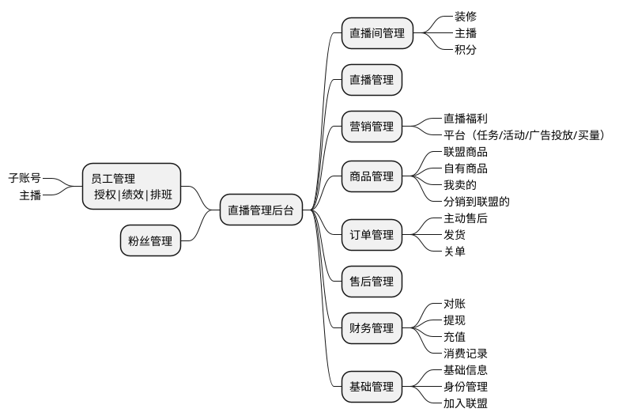

## 直播管理后台



```plantuml
left to right direction

actor "管理员" as admin
actor "澳觅用户" as user
actor "主播" as anchor
actor "场控" as field_ctrlor

package "管理后台" {
    usecase "直播活动管理\n（新增、编辑、删除、备播、\n开播、分享码、控制台、复盘）" as livestream_activity
    usecase "直播活动-备货\n（电商商品、团购）" as livestream_activity_goods
    usecase "直播活动-发券\n（主播券、直播间券）" as livestream_activity_coupon
    usecase "直播活动-控评\n（黑白名单、敏感词）" as livestream_activity_ctrl_evaluate
    
    usecase "控制台\n（实时数据、气氛组工具包、直播商品、\n用户评论、提词卡）" as console
    usecase "主播大屏\n（实时数据、直播商品、提词卡、用户评论）" as anchor_screen
    
    usecase "分类管理\n（列表、新增、编辑、删除）" as bg_category
    usecase "规格管理\n（列表、新增、编辑、删除）" as goods_spec
    usecase "运费模板\n（列表、新增、编辑、删除、详情、批量删除）" as order_ships_rule
    usecase "自提点管理\n（列表、新增、编辑、停用）"
    usecase "商品管理\n（列表、新增、编辑、\n批量上下架，批量编辑、更新库存）" as goods
    usecase "订单管理\n（列表、详情、确认、关单、备注\n批量确认/关单/备注/发货、合并发货）" as order
    usecase "售后维权\n（列表、售后、批量售后、确认提交）" as order_refund
    
    admin --> livestream_activity
    admin --> livestream_activity_goods
    admin --> livestream_activity_coupon
    admin --> livestream_activity_ctrl_evaluate
    
    admin --> bg_category
    admin --> goods_spec
    admin --> goods
    admin --> order_ships_rule
    admin --> order
    admin --> order_refund
    
    field_ctrlor --> console
    anchor --> anchor_screen
}

package "澳觅App" {
    usecase "观看直播" as livestrem_watch
    usecase "直播互动\n（点赞、评论、转发、\n领券、求补货、想要）" as livestream_interactive
    usecase "商品橱窗、待播商品" as goods_window
    usecase "商品详情" as goods_info
    usecase "直播下单（自提点列表）" as submit_order
    usecase "订单列表" as order_list
    usecase "订单详情" as order_info
    usecase "申请售后" as submit_order_refund
    
    user --> livestrem_watch
    user --> livestream_interactive
    user --> goods_window
    user --> goods_info
    user --> submit_order
    user --> order_list
    user --> order_info
    user --> submit_order_refund
}

package "主播端" {
    usecase "登录" as login
    usecase "直播管理\n （分享、进入）" as live_act_opt
    usecase "开播" as live_act_publish
    
    anchor --> login
    anchor --> live_act_opt
    anchor --> live_act_publish
}
```


# 6.3 直播迭代

1. 独立后台及账户体系

    1. 系统用户

        1. 商家
            - 员工账户管理
            - 主播账户管理
        2. 管理员
        3. 用户
        4. 主播

        - 商家主播
        - 自由主播（达人）

   实体商品
   admin -> 创建商户 -> 创建门店 -> 签约直播业务 -> 生成商户、门店账户

   商品登录后台 ->
   门店登录后台 ->

2. 移动开播（主播端）

    1. 使用澳觅分配的账户登录
        1. 澳觅-用户，直播-主播关系？
    2. 直播管理
    3. 开播、下播
    4. 用户标签
        1. 支付成功，打标签。退款呢？
    5. 商品橱窗

3. 分享助力

4. 预约红包

5. 备播间

6. 推送

7. 优化

    - 直播团购商品优化结算价配置

8. 莲花卫视支持